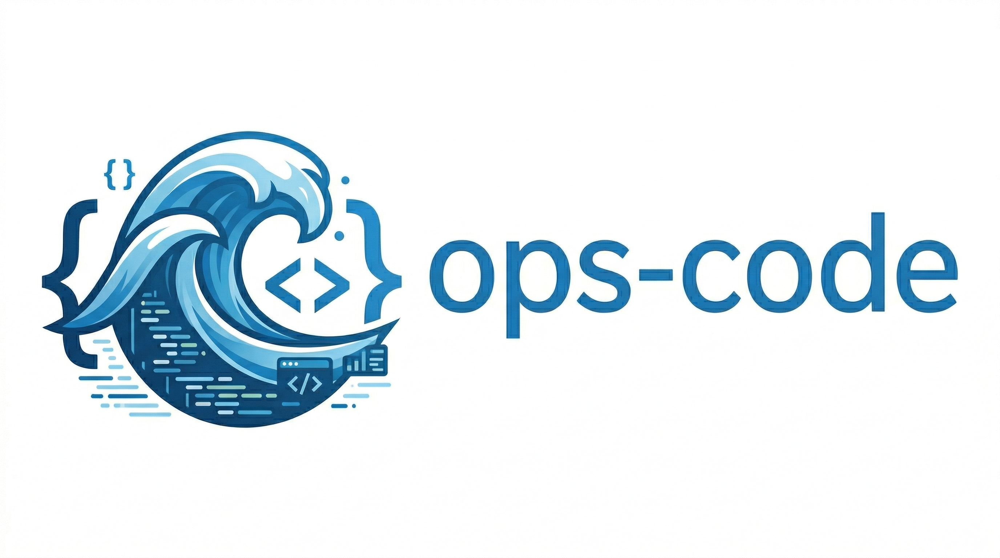

# ops-code

<p align="center">
  
</p>

Run openseespy models directly in VS Code with instant 3D visualization and interactive analysis results.


## Quick Start

1. **Install** the extension from the VS Code Marketplace
2. **Select** openseespy model file
3. **Right-click** → "Run in ops-code"
4. View your 3D model in the viewer panel
5. Click **Run Analysis** in the viewer to execute the model.

## Features

- **3D Visualization** — Real-time rendering of OpenSees models: nodes, elements, supports, and nodal loads
- **Run Analysis** — Execute OpenSeesPy analyses and view results instantly (displacements, reactions, section forces)
- **Force Visualization** — Color-mapped elements by internal forces (N, V, M, T, My, Mz) with interactive rainbow colorbar
- **Code-Driven UI** — Control viewer appearance via Python: color sections, set precision, no UI panels needed
- **Auto-Reload** — Model updates automatically when you save your script

### Example

```python
import openseespy.opensees as ops

# Create model
ops.model('basic', '-ndm', 2, '-ndf', 3)

# Nodes
ops.node(1, 0, 0)
ops.node(2, 10, 0)

# Section and element
ops.section('Elastic', 1, 1000, 1, 1)
ops.element('elasticBeamColumn', 1, 1, 2, 1, 1)

# Support and load
ops.fix(1, 1, 1, 1)
ops.load(2, 10, -100, 0)

# Configure viewer appearance
__viewer__ = {
    'sections': [
        {'tag': 1, 'color': '#e06c75', 'label': 'Main Beam'}
    ],
    'precision': 4
}
```

## Requirements

- **Python 3.7+** on your system
- **openseespy** (for analysis; model viewing works without it via code interception)

To install openseespy:
```bash
pip install openseespy
```

Optional: Configure the Python path in VS Code settings if auto-detection fails.

## Viewer Configuration (`__viewer__`)

Control visualization directly from Python:

```python
__viewer__ = {
    'sections': [
        {
            'tag': 1,
            'color': '#e06c75',      # CSS color
            'label': 'CHS 114x8'     # Optional label shown in Elements tab
        },
        {
            'tag': 2,
            'color': '#4ec9b0',
            'label': 'LS 50x5'
        }
    ],
    'precision': 4,                  # Significant figures in results panel
    'nodalLoads': {
        'scale': 1.5,                # Arrow length multiplier
        'color': '#ff8800'           # CSS color
    },
    'supports': {
        'scale': 1.2,                # Symbol size multiplier
        'color': '#44aaff'           # CSS color
    },
    'label': {
        'size': 1.0                  # Node/element label size multiplier (e.g. 2.0 = double size)
    }
}
```

All fields are optional. An empty `__viewer__ = {}` or missing definition uses defaults.

## Controls

- **Mouse**: Rotate (drag), Pan (middle-click + drag), Zoom (scroll)
- **Analysis panel**: Toggle results visibility, switch between force components
- **Elements tab**: Click to select and view member diagrams
- **Ctrl+S** (viewer focused): Save a screenshot of the current view

## Known Limitations

- 2D and 3D frame elements only (truss, beam, elasticBeamColumn)
- Distributed element loads not yet included in section force diagrams
- Requires `openseespy` for analysis; model geometry loads without it

## Configuration

Set optional preferences in VS Code settings:

- `ops-code.pythonPath` — Path to Python interpreter (auto-detected if blank)
- `ops-code.autoRenderOnSave` — Re-render model on file save (default: true)

## Development

### Setup

1. **Clone the repository:**
   ```bash
   git clone https://github.com/igor-barcelos/ops-code.git
   cd ops-code
   ```

2. **Install dependencies:**
   ```bash
   npm install
   ```

3. **Build the extension:**
   ```bash
   npm run build
   ```

### Running in Debug Mode

1. Open the project in VS Code
2. Press **F5** or go to **Run** → **Start Debugging**
3. A new VS Code window opens with the extension active
4. Open a `.py` file and test: right-click → "Run in ops-code"

### Development Workflow

- **Watch mode** — Auto-rebuild on file changes:
  ```bash
  npm run watch
  ```

- **Build and package VSIX** — Create a distributable package:
  ```bash
  npm run bundle
  ```

- **Package only** — Create VSIX file (after build):
  ```bash
  npm run package
  ```

## License

MIT — see LICENSE file for details.
